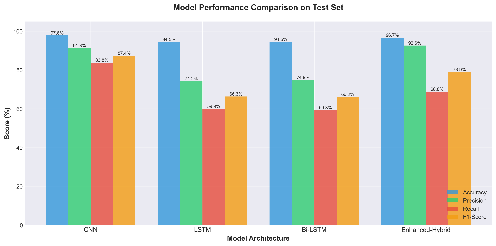
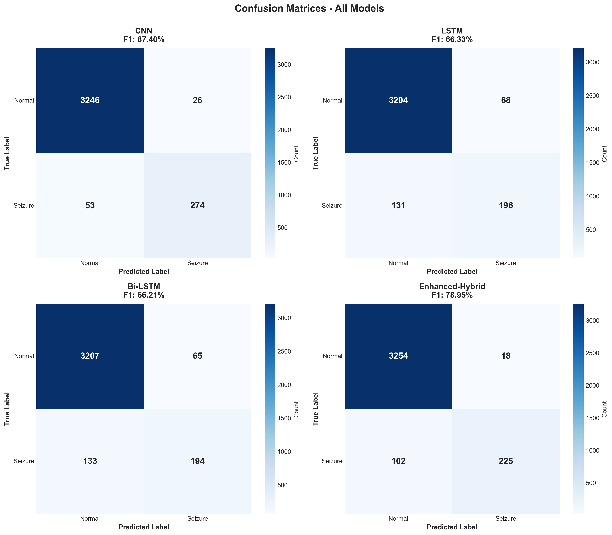

# Epilepsy Seizure Detection from EEG Signals

Deep learning models for automated seizure detection using the CHB-MIT Scalp EEG Database.

## Overview

This project implements multiple deep learning architectures to detect epileptic seizures from EEG recordings. We process pediatric EEG data and train CNN, LSTM, Bi-LSTM, and Hybrid models to classify seizure vs. normal brain activity.

## Dataset

**CHB-MIT Scalp EEG Database**
- **Source**: [Kaggle - CHB-MIT Pediatric Seizure Dataset](https://www.kaggle.com/datasets/abhishekinnvonix/seizure-epilepcy-chb-mit-eeg-dataset-pediatric)
- **Size**: 5 subjects, 23,991 samples (2,181 seizures, 21,810 normal)
- **Channels**: 23 EEG channels
- **Sampling Rate**: 256 Hz → 64 Hz (downsampled)
- **Window Size**: 4 seconds with 3-second overlap (75%)
- **Class Distribution**: 9.09% seizures, 90.91% normal (imbalanced)

## Models

| Model | Parameters | Description |
|-------|------------|-------------|
| **CNN** | 101,889 | Spatial feature extraction baseline |
| **LSTM** | 66,689 | Temporal sequence learning |
| **Bi-LSTM** | 212,865 | Bidirectional temporal patterns |
| **Enhanced Hybrid** | 459,777 | Deep CNN + Large Bi-LSTM |

## Results

All models trained on 5 subjects with balanced batch sampling and focal loss:

| Rank | Model | Accuracy | Precision | Recall | F1-Score |
|------|-------|----------|-----------|--------|----------|
| 🥇 | **CNN** | **97.80%** | **91.33%** | **83.79%** | **87.40%** |
| 🥈 | Enhanced Hybrid | 96.67% | 92.59% | 68.81% | 78.95% |
| 🥉 | LSTM | 94.47% | 74.24% | 59.94% | 66.33% |
| 4 | Bi-LSTM | 94.50% | 74.90% | 59.33% | 66.21% |

**Key Findings**:
- **CNN achieved the best overall performance** (87.40% F1-score) with excellent balance of precision and recall
- Enhanced Hybrid showed highest precision (92.59%) but lower recall
- All models achieved >94% accuracy on the imbalanced test set




## Project Structure

```
Epilepsy-Detection/
├── data/
│   ├── raw/                          # Raw EEG files (download separately)
│   └── processed/                    # Preprocessed data (preprocessed_data.h5)
├── models/                            # Trained models (.keras files)
├── notebooks/
│   ├── 01_exploratory_data_analysis.ipynb    # Dataset exploration
│   ├── 02_preprocessing.ipynb                 # Data preprocessing
│   └── 03_model_training.ipynb                # Model training
├── requirements.txt
├── README.md
└── REPORT.md
```

## Quick Start

### 1. Setup

```bash
git clone https://github.com/PranaavPrasad/Epilepsy-Detection.git
cd Epilepsy-Detection

python -m venv .venv
.venv\Scripts\activate  # Windows
# source .venv/bin/activate  # Linux/Mac

pip install -r requirements.txt
```

### 2. Download Dataset

Configure Kaggle API (`~/.kaggle/kaggle.json`) and download:

```bash
kaggle datasets download -d abhishekinnvonix/seizure-epilepcy-chb-mit-eeg-dataset-pediatric -p data/raw --unzip
```

### 3. Run Notebooks

Execute notebooks in order:
1. `01_exploratory_data_analysis.ipynb` - Explore dataset
2. `02_preprocessing.ipynb` - Preprocess EEG data
3. `03_model_training.ipynb` - Train and evaluate models

## Key Features

- **Data Augmentation**: Gaussian noise + amplitude scaling (training only)
- **Balanced Batches**: 20% seizures (train), 15% (validation) to handle imbalance
- **Focal Loss**: Addresses class imbalance (gamma=2.0, alpha=0.70)
- **Strong Regularization**: Dropout, L2, BatchNorm to combat 75% temporal overlap

## Requirements

- Python 3.8+
- TensorFlow 2.x
- NumPy, Pandas, Matplotlib, Seaborn
- MNE (EEG processing)
- h5py (HDF5 file handling)
- scikit-learn

See `requirements.txt` for complete list.

## References

- **Dataset**: [CHB-MIT Scalp EEG Database](https://physionet.org/content/chbmit/1.0.0/)
- **Paper Inspiration**: "A hybrid CNN-Bi-LSTM model with feature fusion for accurate epilepsy seizure detection"

## License

This project is for educational purposes.

## Author

Pranaav Prasad

---

*For detailed methodology and results, see [REPORT.md](REPORT.md)*
